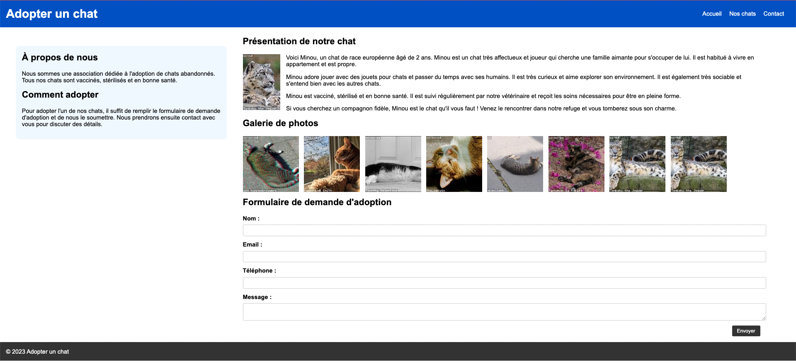

# TP 1

Récupérer le code source de la page :
https://jsfiddle.net/8nphr6u5/

Faire en sorte que rendu de la page ressemble à celui-ci :

Pour ce TP, vous pouvez utiliser les propriétés suivantes :
- `float`
- `clear`
- `display`

## TP 2

Maintenant, remplacer le style pour maintenant utiliser les flexbox et les grid template.

